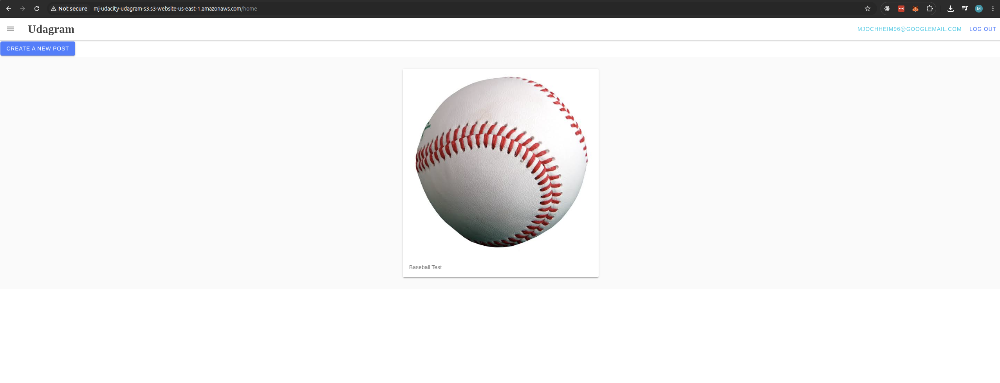

# Udagram

## Project Overview

Udagram is a full-stack image feed application. The frontend is an Ionic/Angular single-page application hosted as a static website on Amazon S3. The backend is a Node.js/Express API deployed to AWS Elastic Beanstalk. Application data is stored in PostgreSQL on Amazon RDS, and environment-specific values are provided through configuration and deployment environment variables.

## Hosted Application

Frontend URL: [http://mj-udacity-udagram-s3.s3-website-us-east-1.amazonaws.com](http://mj-udacity-udagram-s3.s3-website-us-east-1.amazonaws.com)

## Working Application Screenshot



## Documentation

- [Infrastructure description](docs/Infrastructure_description.md)
- [Infrastructure architecture diagram](docs/Architecture.md)
- [Pipeline description](docs/Pipeline_description.md)
- [Pipeline diagram](docs/Pipeline.md)
- [Application dependencies](docs/Application_dependencies.md)

## Project Scripts

The root `package.json` provides project-level scripts for installing, building, testing, running, and deploying the frontend and API:

```bash
npm run frontend:install
npm run frontend:build
npm run frontend:test
npm run api:install
npm run api:build
npm run api:start
npm run deploy
```
