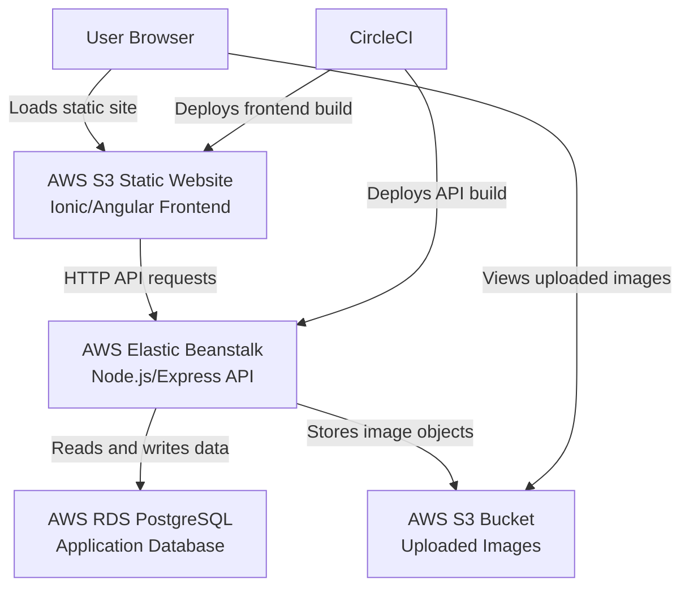

# Infrastructure Architecture

This diagram shows the high-level production infrastructure used by Udagram. The frontend is hosted from S3, the API runs on Elastic Beanstalk, persistent data is stored in RDS PostgreSQL, and uploaded files are stored in S3.
