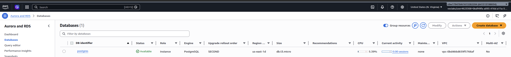
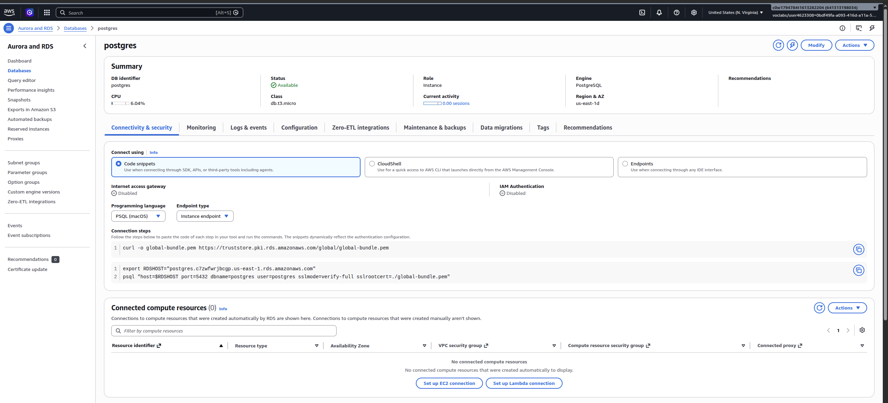
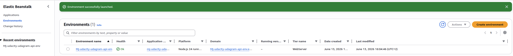
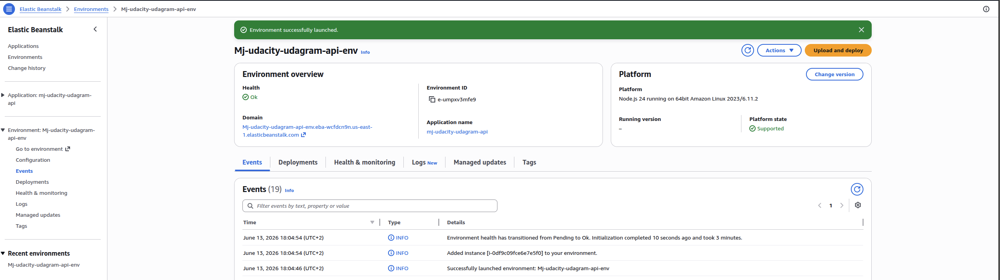
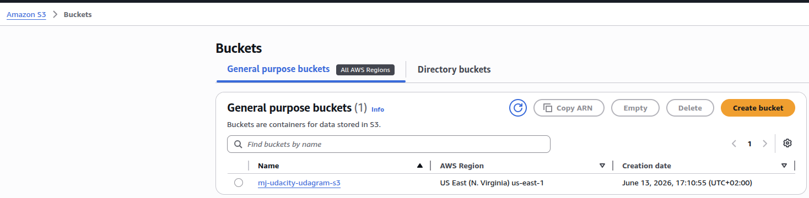
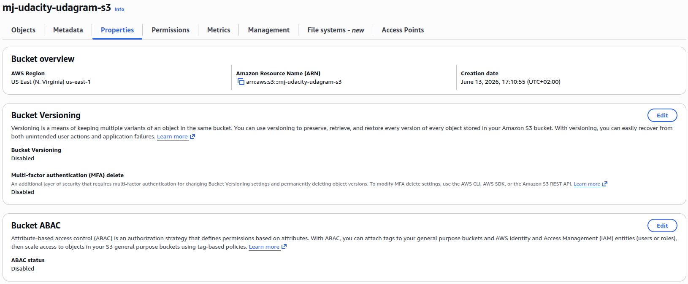
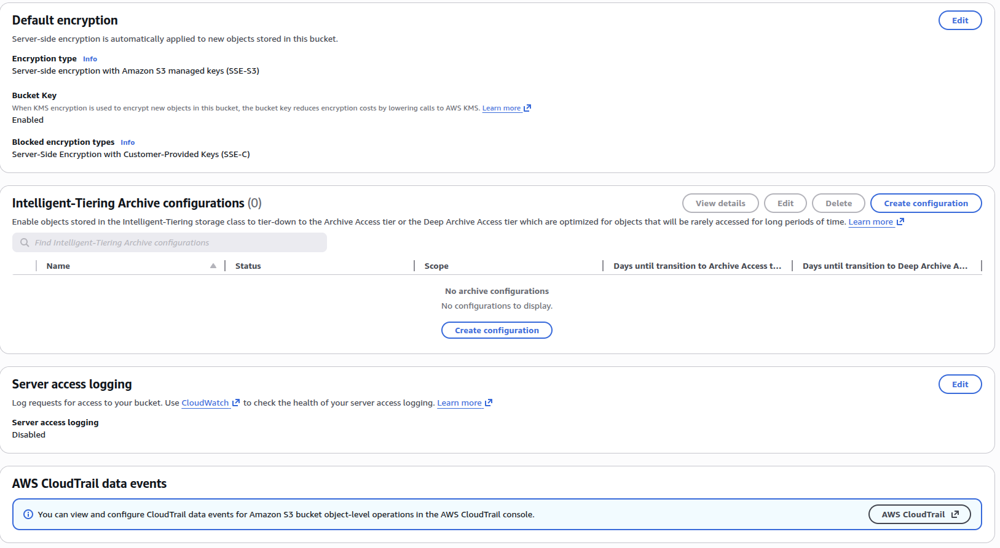
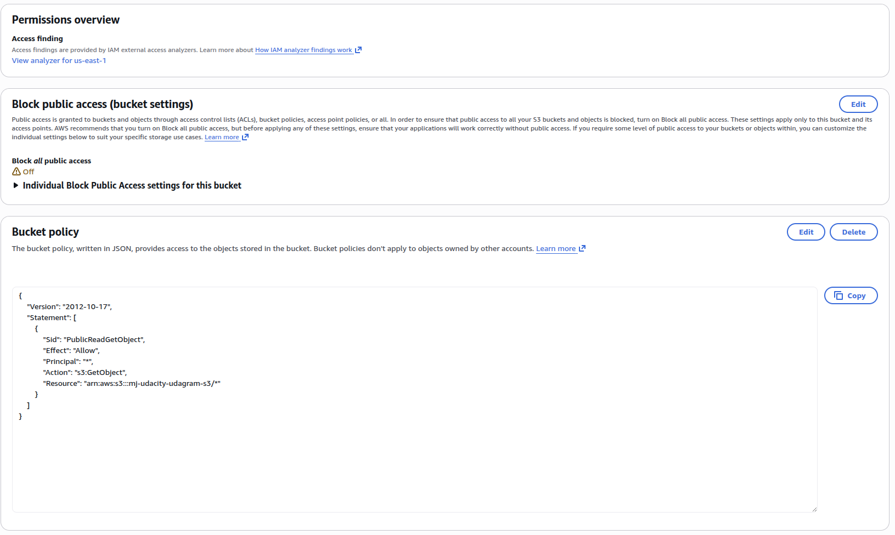

# Infrastructure Description

## AWS Services

Udagram uses the following AWS services:

| Service | Purpose |
| --- | --- |
| Amazon S3 | Hosts the compiled Ionic/Angular frontend as a static website. The same deployment also uses S3 object storage for application image files. |
| AWS Elastic Beanstalk | Hosts the Node.js/Express backend API. The API is deployed from the compiled backend bundle. |
| Amazon RDS | Hosts the PostgreSQL database used by Sequelize models for users and feed items. |
| IAM | Provides deployment credentials used by CircleCI to publish builds to S3 and Elastic Beanstalk. |

## Deployed Resources

- Frontend S3 bucket: `mj-udacity-udagram-s3`
- Frontend URL: `http://mj-udacity-udagram-s3.s3-website-us-east-1.amazonaws.com`
- API Elastic Beanstalk environment: `Mj-udacity-udagram-api-env`
- API URL: `http://mj-udacity-udagram-api-env.eba-wcfdcn9n.us-east-1.elasticbeanstalk.com/api/v0`
- Database: PostgreSQL on Amazon RDS

## Architecture Diagram

See [Architecture.md](Architecture.md).

## Infrastructure Screenshots

### RDS

### Elastic Beanstalk

### S3

## Environment Configuration

Environment-specific and secret values are not committed to source code. The production API loads configuration from environment variables through `udagram/udagram-api/src/config/config.ts`. CircleCI stores the required secrets as project environment variables for deployment, and the deploy job runs `eb setenv` to copy the backend runtime values into the Elastic Beanstalk environment properties. The running API process reads those values from Elastic Beanstalk at runtime, not from checked-in files.

Production values include:

- `POSTGRES_HOST`
- `POSTGRES_DB`
- `POSTGRES_USERNAME`
- `POSTGRES_PASSWORD`
- `AWS_BUCKET`
- `AWS_ACCESS_KEY_ID`
- `AWS_SECRET_ACCESS_KEY`
- `AWS_SESSION_TOKEN`
- `AWS_REGION`
- `JWT_SECRET`
- `URL`

Elastic Beanstalk production environment properties should include after CircleCI copy:

- `POSTGRES_HOST`
- `POSTGRES_DB`
- `POSTGRES_USERNAME`
- `POSTGRES_PASSWORD`
- `AWS_BUCKET`
- `AWS_ACCESS_KEY_ID`
- `AWS_SECRET_ACCESS_KEY`
- `AWS_SESSION_TOKEN`
- `AWS_REGION`
- `JWT_SECRET`
- `URL`

`AWS_ACCESS_KEY_ID`, `AWS_SECRET_ACCESS_KEY`, and `AWS_SESSION_TOKEN` must belong to the same temporary AWS credentials session. If the session expires or only one of the three values is updated, the backend can still generate signed S3 URLs, but S3 rejects uploads with `InvalidToken`.
