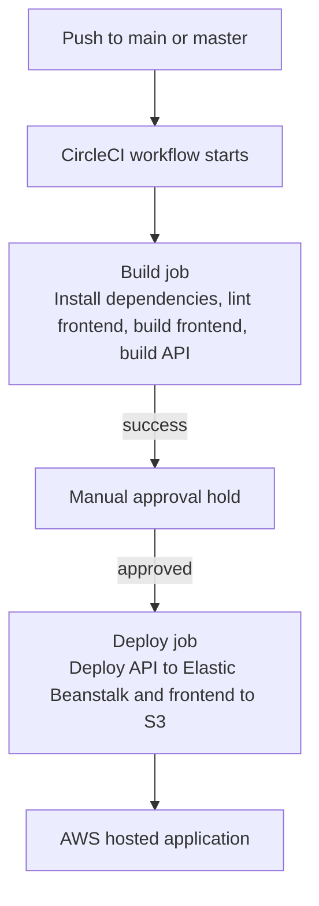

# Pipeline Diagram

```mermaid
graph TD
    Push[Push to main or master]
    CircleCI[CircleCI workflow starts]
    Build[Build job<br/>Install dependencies, lint frontend, build frontend, build API]
    Hold[Manual approval hold]
    Deploy[Deploy job<br/>Deploy API to Elastic Beanstalk and frontend to S3]
    AWS[AWS hosted application]

    Push --> CircleCI
    CircleCI --> Build
    Build -->|success| Hold
    Hold -->|approved| Deploy
    Deploy --> AWS
```

The workflow is defined in `.circleci/config.yml`. CircleCI runs the build first, waits for manual approval, then deploys the API and frontend.
