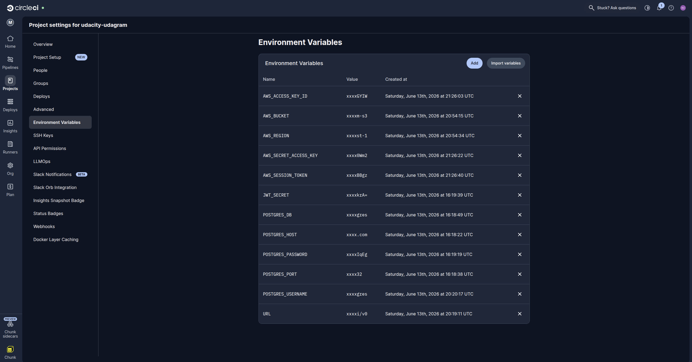
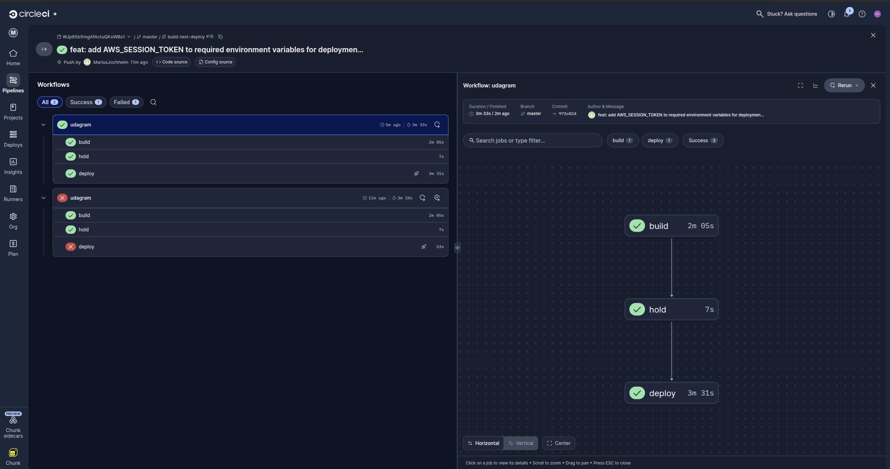
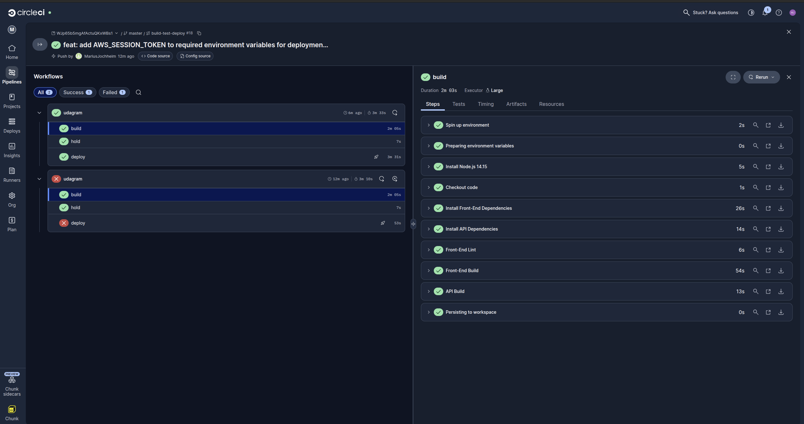
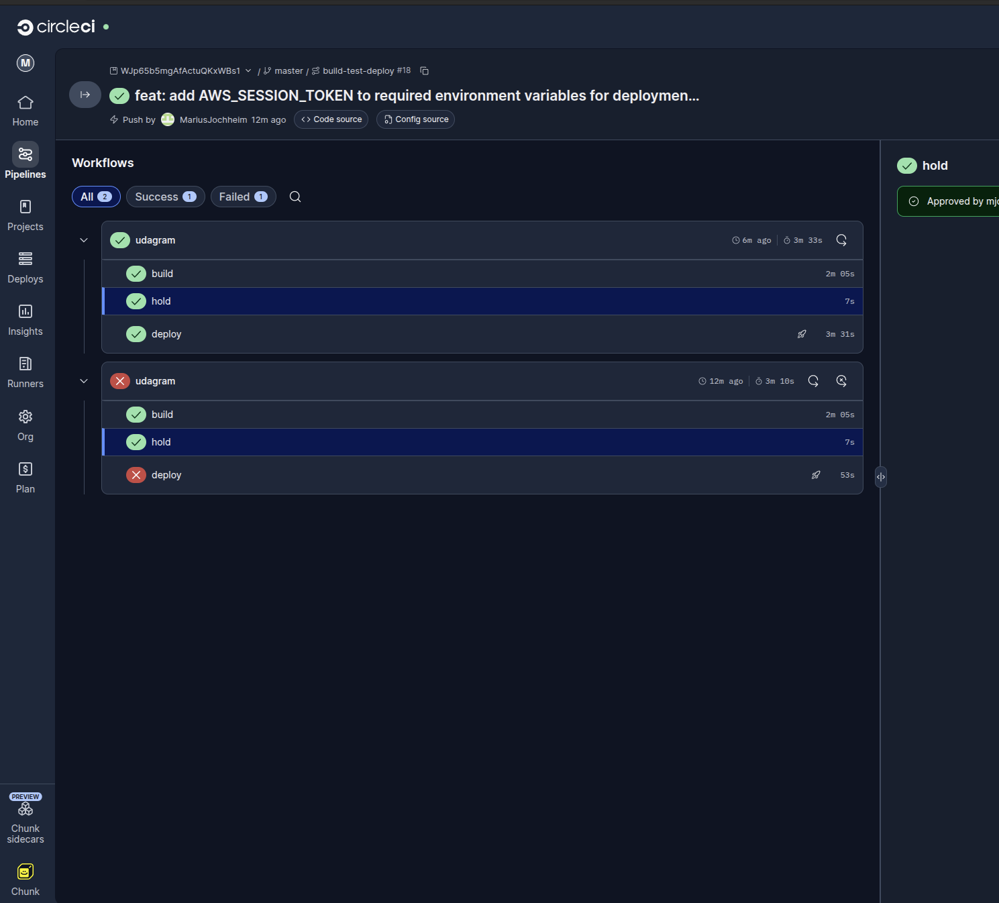
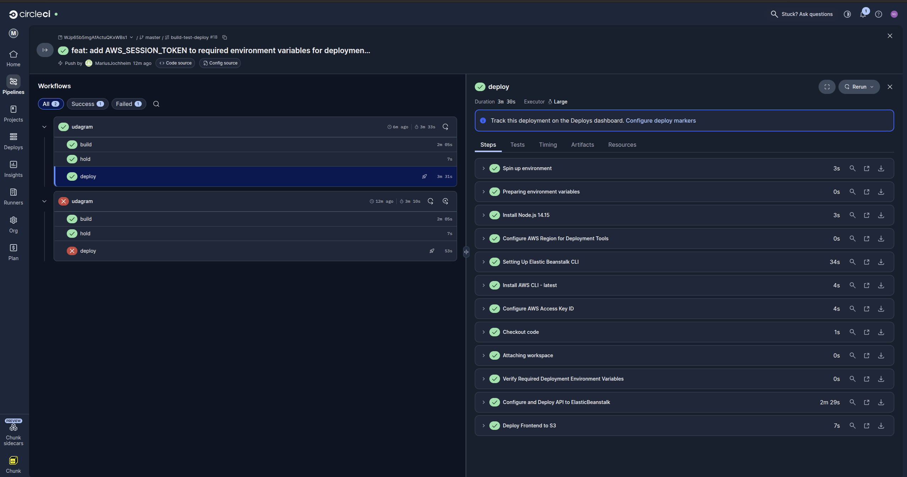

# Pipeline Description

## Overview

The deployment pipeline is configured in `.circleci/config.yml`. CircleCI is connected to the GitHub repository and runs the workflow when code is pushed to the `main` or `master` branch.

## Pipeline Steps

1. Checkout source code from GitHub.
2. Install frontend dependencies with `npm run frontend:install`.
3. Install API dependencies with `npm run api:install`.
4. Run frontend linting with `npm run frontend:lint`.
5. Build the frontend with `npm run frontend:build`.
6. Build the API with `npm run api:build`.
7. Persist the frontend and API build outputs to the CircleCI workspace.
8. Wait for manual approval in the `hold` job.
9. Deploy the API to Elastic Beanstalk with `npm run api:deploy`.
10. Deploy the frontend build to S3 with `aws s3 sync`.
11. Configure the S3 bucket for static website hosting.

## Pipeline Diagram

See [Pipeline.md](Pipeline.md).

## CircleCI Screenshots











## Secrets

Production secrets are configured outside the repository. CircleCI stores the required deployment and application secrets as project environment variables. During the deploy job, CircleCI validates that the required variables exist, uses the AWS credentials to deploy the backend bundle to Elastic Beanstalk, and runs `eb setenv` so the Elastic Beanstalk production environment receives the same runtime values that the backend reads from `udagram/udagram-api/src/config/config.ts`.

These values are not committed to the repository. The checked-in `udagram/set_env.sh` file is only a local development template.

Required CircleCI project environment variables:

- `AWS_ACCESS_KEY_ID`
- `AWS_SECRET_ACCESS_KEY`
- `AWS_SESSION_TOKEN`
- `AWS_REGION`
- `AWS_BUCKET`
- `POSTGRES_HOST`
- `POSTGRES_DB`
- `POSTGRES_USERNAME`
- `POSTGRES_PASSWORD`
- `JWT_SECRET`
- `URL`

This project uses temporary AWS credentials. `AWS_ACCESS_KEY_ID`, `AWS_SECRET_ACCESS_KEY`, and `AWS_SESSION_TOKEN` must all come from the same current AWS credentials session. If one value is old or copied from a different session, S3 pre-signed upload URLs fail with `InvalidToken`.

Copy the values into CircleCI exactly as plain values. Do not include `export`, quotes, trailing spaces, or line breaks. With temporary AWS credentials, `AWS_ACCESS_KEY_ID` usually starts with `ASIA`; if it starts with `AKIA`, it is usually a long-lived key and should not be combined with a session token.

Do not use `POSTGRES_USER` or `AWS_DEFAULT_REGION` as the project variable names for this application. The backend configuration expects `POSTGRES_USERNAME` and `AWS_REGION`, so CircleCI and Elastic Beanstalk must use those exact names.

The CircleCI AWS and Elastic Beanstalk tooling expects `AWS_DEFAULT_REGION` internally. The deploy job derives that value from `AWS_REGION` at runtime, so `AWS_DEFAULT_REGION` does not need to be stored as a separate CircleCI project secret.

The deploy job passes these backend runtime values to Elastic Beanstalk:

```bash
eb setenv \
  POSTGRES_USERNAME="$POSTGRES_USERNAME" \
  POSTGRES_PASSWORD="$POSTGRES_PASSWORD" \
  POSTGRES_HOST="$POSTGRES_HOST" \
  POSTGRES_DB="$POSTGRES_DB" \
  JWT_SECRET="$JWT_SECRET" \
  AWS_BUCKET="$AWS_BUCKET" \
  AWS_REGION="$AWS_REGION" \
  AWS_ACCESS_KEY_ID="$AWS_ACCESS_KEY_ID" \
  AWS_SECRET_ACCESS_KEY="$AWS_SECRET_ACCESS_KEY" \
  AWS_SESSION_TOKEN="$AWS_SESSION_TOKEN" \
  URL="$URL"
```

When AWS temporary credentials expire, update all three AWS credential values in CircleCI and redeploy so Elastic Beanstalk receives the refreshed session.

The deploy job validates the AWS credentials with `aws sts get-caller-identity` before running `eb setenv`. If that check fails with `The security token included in the request is invalid`, the CircleCI AWS credential values are expired, malformed, or not from the same session.
